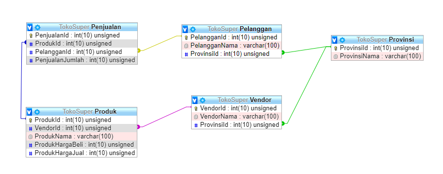

# Dummy Database untuk tugas eksplorasi SBD

Struktur database dibuat dengan manual. Dummy data dibuat secara otomatis menggunakan [Faker](https://github.com/marak/Faker.js/).

- sbd-eksplorasi-mysql.sql -> berisi kueri untuk membuat tabel dan mengisinya dengan dummy data, tested on mariadb
- sbd-eksplorasi-sqlite.sql -> berisi kueri untuk membuat tabel dan mengisinya dengan dummy data, tested on sqlite3
- sbd-eksplorasi.sqlite -> database sqlite yang didalamnya sudah terdapat tabel dan dummy data

## Diagram lliveuml

## Diagram phpmyadmin

